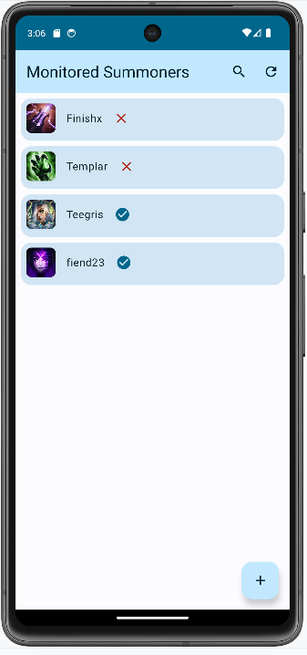
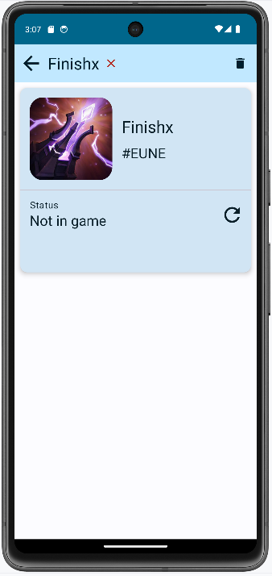
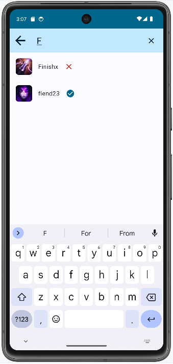
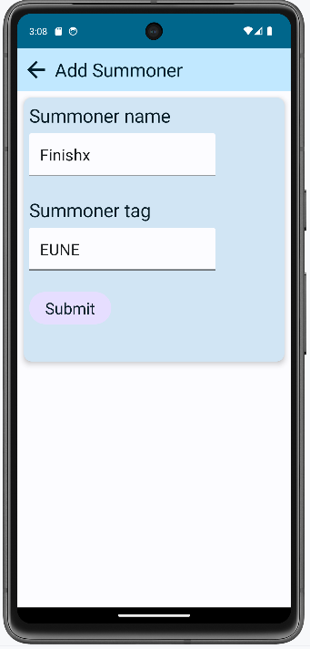

# Tajňák Buster

Tajňák (in english something along the lines of "secretive thing") is a term me and my friends use
to describe a League of Legends match, which has not been announced, therefore is
played in secret. The person playing is also called a tajňák.

Tajňák Buster is an Android application, where players are able to put other summoners (League of
Legends jargon for players) on a "watch list". Whenever watched summoner starts a game of League of
Legends, the application will "bust" them by sending an Android notification.

## Riot API

Riot provides extensive API for each of their games and also many other useful resources (summoner
icons, ability icons etc.) for developers, although there are some limitations regarding
these services.

For starters the aforementioned API calls require an API *key* to be provided. The most
basic Developer Api key automatically regenerates every 24 hours and is useful for just testing the
individual API calls. Personal and production API keys don't regenerate on their own, but they need
to be approved by Riot themselves. Developer and personal tokens have relatively low rate limits of
20 requests every second and 100 requests every 2 minutes. Production tokens start at much higher
500 requests every 10 seconds and 30,000 requests every 10 minutes. Personal tokens are given
liberally to almost anyone with half-decent personal use-case (school work, personal site statistics
etc.), production tokens on the other hand are heavily restricted.

For Tajňák Buster a personal token was successfully acquired by registering it as a product.

## Big picture

The application has two concerns -- managing monitored summoners and periodically monitoring them.
Google's recommended Android architecture is used.

### Managing summoners

Summoners can be added by their Riot Id which consists of summoner name and summoner tag, commonly
displayed like so: <summonerName>#<summonerTag>. When adding a summoner, it is checked if the
summoner with given Riot Id actually exists and if so, he is saved into local Room DB.

### Monitoring summoners

To reasonably deal with API rate limits, there should ideally be a backend application periodically
checking if monitored summoners are in game and notifying users, which have them on their "watch
list"

The checks at the moment happen on individual Android devices, which affects scalability of the
application. Meaning that if e.g. 6 people monitor each other and all of them randomly call the API
at the exact same second, the rate limit will be exceeded, whereas backend would do at max 6 API
calls.

Also Android does not natively support PeriodicWorkers with period of less than 15 minutes, most
likely because of battery concerns. But a game of League of Legends can be shorter than 15 minutes,
resulting in misses - not registering a Tajňák, when it happens. Workarounds are possible, but are
complex, error-prone and will probably impact battery life.

Even with these limitations in mind, 4 people monitoring themselves should be low-enough load to
practically never reach API rate limits.

## Usage

Input your own Riot Api key into a `riotApiKey` variable in `local.properties` file, then compile
and start application in Android Studio.

## Future extensions and known issues

Possible future extensions to Android Tajňák Buster:

- The application is locked to EUNE region
- More information displayed regarding summoners and the games they played
- Optimize Android periodic work around rate limits ~ wait a second between calls etc.
- Last check times being shown
- Refresh button on List screen is for debugging purposes - calls the NotifyOnNewGameUseCase, which
  activates the notifications, should be reworked/removed later
- Refresh buttons should visually signal that they are doing something

## Screenshots

### List screen

### Detail screen

### Search screen

### Add screen

